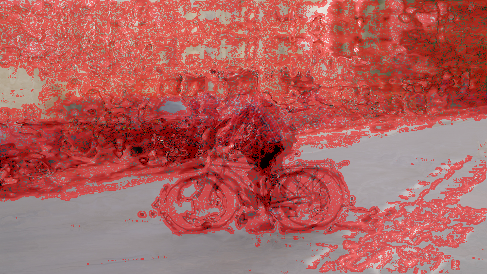
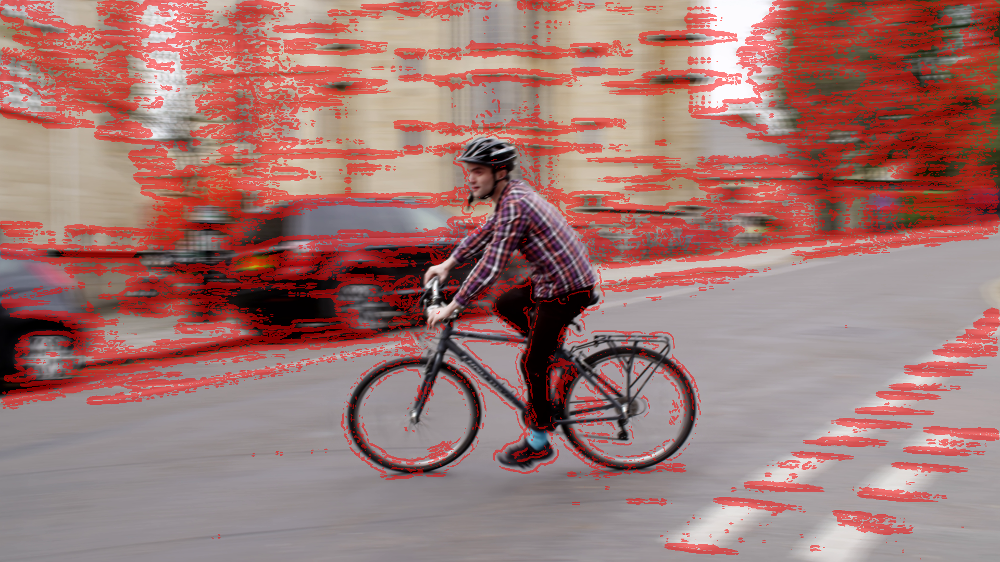

# An Efficient Quality Metric for Video Frame Interpolation Based on Motion-Field Divergence

Authors: Conall Daly, Darren Ramsook, Anil Kokaram (Trinity College Dublin)
IEEE 17th International Conference on Quality of Multimedia Experience (QoMEX) 2025

[](https://arxiv.org/abs/2510.01361)
[](https://qomex2025.org/)

**PSNR-DIV** is a full-reference video quality metric that enhances standard PSNR by weighting image errors based on **motion-field divergence**. Adapted from archival film restoration techniques, it detects temporal inconsistencies in video frame interpolation.

## Installation

We recommend using uv for managing environments.

```bash
uv venv
uv pip install -r requirements.txt
```

## Quick Start

```python
import cv2
import numpy as np
from psnr_div import calculate_psnr_div, calculate_psnr_simple, compute_farneback_flow, convert_rgb_to_y_bt709

# Load frames
ref_frame = cv2.imread('ref.png')
dis_frame = cv2.imread('dis.png')

# Convert to luminance (BT.709)
ref_y = convert_rgb_to_y_bt709(ref_frame)
dis_y = convert_rgb_to_y_bt709(dis_frame)
# ...

# Compute optical flow on distorted frames
flow = compute_farneback_flow(dis_frame, next_dis_frame)

# Standard PSNR
psnr = calculate_psnr_simple(ref_y, dis_y)

# PSNR_DIV (weights by motion divergence)
psnr_div = calculate_psnr_div(ref_y, dis_y, flow)
```

## The PSNR-DIV Metric

Standard PSNR treats all pixel errors equally, but human perception is sensitive to temporal inconsistencies. PSNR-DIV addresses this by weighting errors based on **motion-field divergence**.

## Examples

### Divergence Overlays

Motion divergence overlays visualize regions with high divergence (potential artifacts). Red regions indicate high divergence:

**DVF (Depth-Aware Video Frame Interpolation):**



**STMFNet (Spatio-Temporal Multi-Frame Network):**



### Metric Comparison

Using 150 frames from the [BVI-VFI](https://github.com/danier97/BVI-VFI-database) cyclist sequence (1920×1080, 30fps), comparing against ground truth:

| Method   | PSNR (dB) | PSNR_DIV (dB) |
|----------|-----------|---------------|
| DVF      | 17.36     | 16.03         |
| STMFNet  | 36.68     | 36.46         |

STMFNet shows significantly better quality on both metrics. The divergence weighting in PSNR-DIV reveals that DVF has more temporal inconsistencies, which are penalised by the metric.

## Citation

```bibtex
@inproceedings{daly2025psnrdiv,
  title={An Efficient Quality Metric for Video Frame Interpolation Based on Motion-Field Divergence},
  author={Daly, Conall and Ramsook, Darren and Kokaram, Anil},
  booktitle={IEEE 17th International Conference on Quality of Multimedia Experience (QoMEX)},
  year={2025},
  eprint={2510.01361},
  archivePrefix={arXiv},
  primaryClass={eess.IV}
}
```

## License

CC BY-NC (Non-Commercial)
